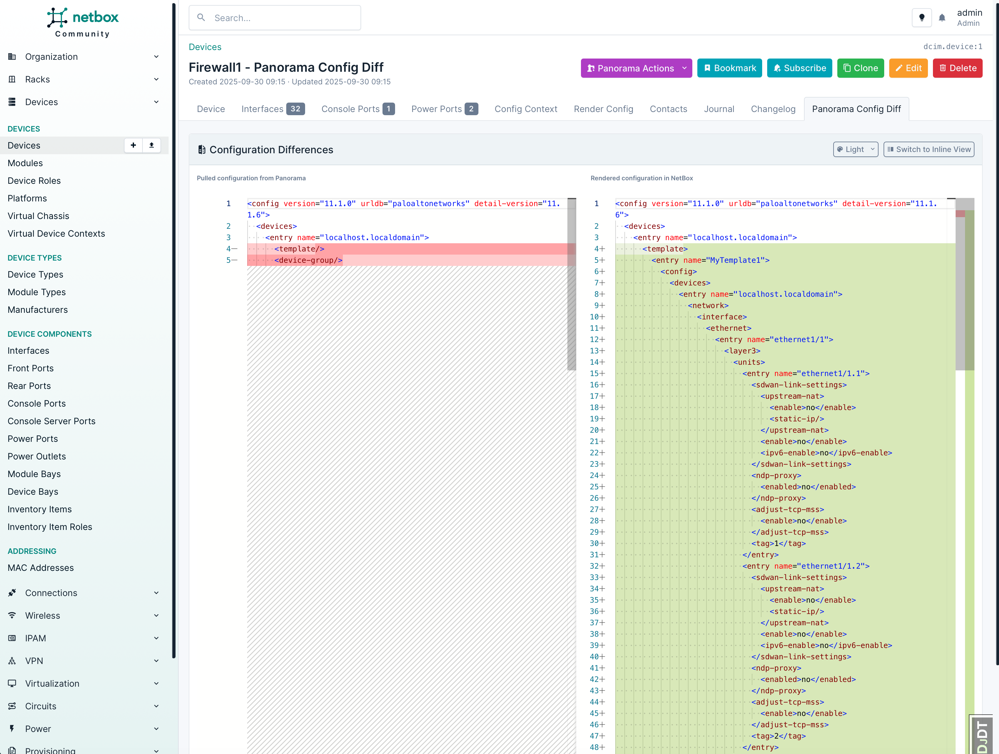
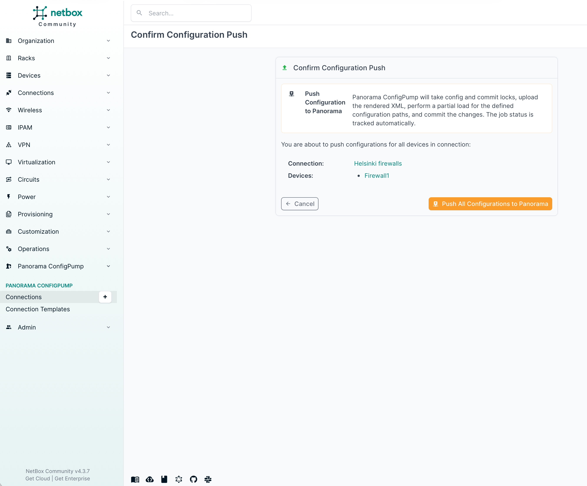

# NetBox Panorama ConfigPump Examples

This guide walks through a complete example of using the NetBox Panorama ConfigPump plugin to generate, diff, and push configuration to Palo Alto Networks Panorama.

If you have not enabled and configured the plugin yet, start with the [README](README.md) and [CONFIGURATION](CONFIGURATION.md) guides.

### Prerequisites
- Ensure the plugin is enabled and configured. See [CONFIGURATION.md](CONFIGURATION.md).
- Panorama API token(s) available via `PLUGINS_CONFIG["netbox_panorama_configpump_plugin"]["tokens"]`.
- Create NetBox `Device` objects for the firewalls you want to keep in sync.

1. Create the devices in NetBox.

2. Create a Config Template that defines the Panorama API payload using XML and Jinja. This template generates an XML configuration tailored to each firewall. See the [sample template](examples/v11.1.6/template_example.xml.j2) for reference. The template typically iterates over device interfaces to build the XML required by Panorama. Later, associate this Config Template with a NetBox object that is also related to your devices (e.g., a `Platform` such as PAN-OS).

3. Assign the Config Template to a NetBox object associated with the firewalls (in this example, the PAN-OS `Platform`). Ensure this platform is assigned to the firewall devices you created. Note: Config Templates can also be assigned to `Device Roles` or directly to individual `Device` objects.

4. Create a Connection Template to define how to connect to a Panorama instance.

5. Create a Connection and assign NetBox devices (firewalls) to it via the Connection Template.

6. Open the Connection. You should see generated XML ready to upload to Panorama. Pull the current candidate configuration from Panorama to refresh the diff.

7. After the pull, some lines may show as updated (not only new lines). Open the diff view to understand the changes.

8. The diff view may reveal empty `template` and `device-group` elements in Panorama. The plugin updates these XML elements as needed.

9. Push the configuration to Panorama. This stages changes in Panorama’s candidate configuration.

10. Confirm the push operation. After you confirm, the candidate configuration in Panorama is updated—changes are staged but not yet committed or active. Commit in Panorama to apply.

For each device included in the connection, the plugin performs the following steps:
   1. Uploads an XML file to Panorama named `<prefix>_<device_name>.xml` (for example, `netbox-panorama_firewall1.xml`).
   2. For every `template` element in the XML, it partially updates the configuration at the XPath: `devices/entry[@name='localhost.localdomain']/template/entry[@name='<template name>']`.
   3. For every `device-group` element in the XML, it partially updates the configuration at the XPath: `devices/entry[@name='localhost.localdomain']/device-group/entry[@name='<device-group name>']`.
   4. Retrieves (pulls) the updated candidate configuration from Panorama to ensure the changes were applied as expected.

11. If everything worked as expected, you should see no remaining diff.

12. Make a change in NetBox, for example by deleting a sub-interface from a firewall.

13. The change is reflected in the diff view.

14. Push the update to Panorama again.

15. After the update, there should be no diff.

16. Verify the results in Panorama. You should see the new file under: Panorama → Operations → Export named Panorama configuration snapshot.

17. Under Network → Interfaces, you should see the uploaded Templates and configuration matching the data in NetBox.

18. Under Objects → Addresses, you should see the uploaded Device Groups and configuration matching the Config Template data (dynamic data from NetBox can be mapped here as needed).

