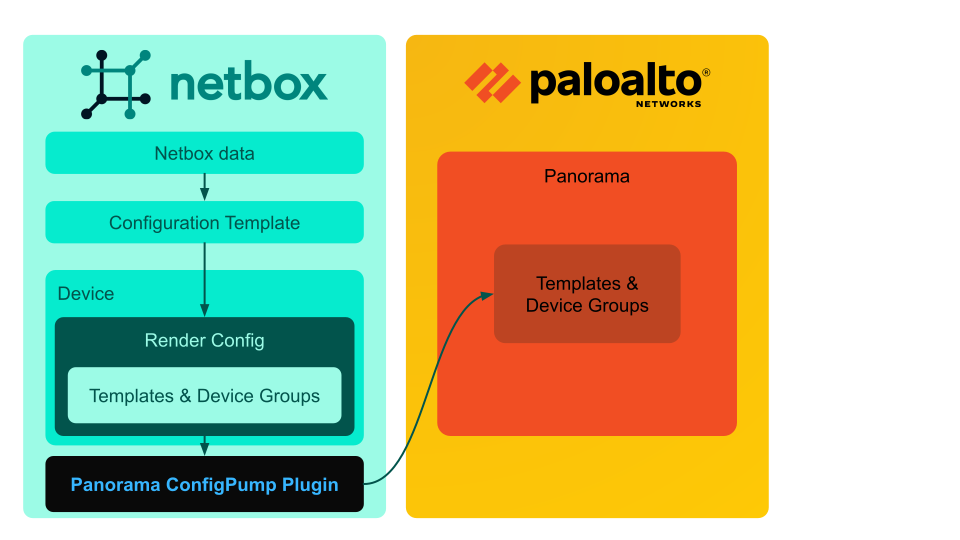
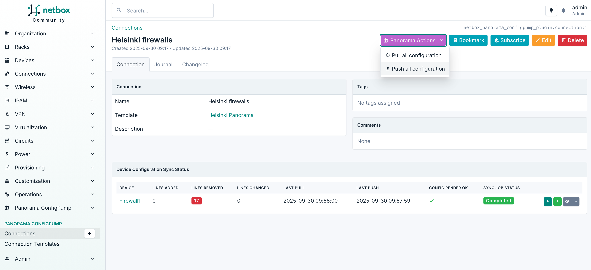

# NetBox Panorama ConfigPump Plugin

A NetBox plugin that synchronizes configurations from NetBox to Palo Alto Networks Panorama with a pull → diff → push workflow.



## Overview

This plugin enables you to declare Panorama configuration in NetBox, render it from NetBox objects using [Configuration Templates](https://netboxlabs.com/docs/netbox/models/extras/configtemplate/) in [Panorama XML format](https://docs.paloaltonetworks.com/ngfw/api/getting-started), preview the diff, and stage changes to Panorama.

- **Configuration synchronization**: Keeps [Panorama Templates](https://docs.paloaltonetworks.com/panorama/11-1/panorama-admin/panorama-overview/centralized-firewall-configuration-and-update-management/templates-and-template-stacks) and [Device Groups](https://docs.paloaltonetworks.com/panorama/11-1/panorama-admin/panorama-overview/centralized-firewall-configuration-and-update-management/device-groups) in sync.
- **Declarative updates**: Full-template and device-group **overwrites** in a single, deterministic operation (not incremental diffs of individual fields).
- **Inline diff UI**: Uses [Monaco Editor](https://github.com/microsoft/monaco-editor) to display XML diffs before you push.
- **Background jobs**: All long-running sync operations are executed asynchronously.

<div align="center">
  
</div>

## Introduction video
[](https://youtu.be/9GfsvGQwZU0)


## Concepts

- **Config Template**: Jinja + XML template that renders device-specific Panorama XML using NetBox data. See: [examples/v11.1.6/template_example.xml.j2](examples/v11.1.6/template_example.xml.j2)
- **Connection Template**: Defines how to connect to a Panorama instance (host, token reference, defaults).
- **Connection**: Binds devices to a specific Panorama instance and orchestrates pull/diff/push for those devices.

## Quickstart

1. Create firewall `Device` objects in NetBox.
2. Create a **Config Template** (Jinja + XML) that renders Panorama XML from your NetBox data.
3. Create a **Connection Template** for your Panorama instance (host + token key).
4. Create a **Connection**, assign devices, then open it to view the generated XML and diff.
5. Pull candidate config from Panorama to refresh the diff.
6. Push to stage changes in Panorama (then commit in Panorama to apply).

Refer to [EXAMPLES.md](EXAMPLES.md) for screenshots of each step.

> [!CAUTION]
> When you push configuration from NetBox using Panorama ConfigPump, any Panorama templates and device groups defined in the rendered config for a device are **completely overwritten** in Panorama. In other words, ConfigPump takes full ownership of those specific templates and device groups. Any manual changes made directly in Panorama to them will be lost on the next push.
>
> To avoid losing manual configurations, keep any manually managed settings in **separate** templates and device groups that are not managed by ConfigPump. You can combine both manual and NetBox-managed configurations by using Panorama’s Template Stacks and Device Group Hierarchy features.

## Compatibility

Tested combinations:

| Plugin Version | NetBox Versions   | Panorama versions |
|:--------------:|:-----------------:|:-----------------:|
|      1.0.1     |   4.2.5 - 4.3.7   |  10.2.10, 11.1.6  |
|      1.0.0     |   4.2.5 - 4.3.7   |  10.2.10, 11.1.6  |

## Installation

1. Install the plugin in the NetBox environment:
   ```bash
   pip install netbox-panorama-configpump-plugin
   ```

2. Enable the plugin in NetBox `configuration.py`:
   ```python
   PLUGINS = [
       "netbox_panorama_configpump_plugin",
   ]

   PLUGINS_CONFIG = {
       "netbox_panorama_configpump_plugin": {
           # minimal example — see CONFIGURATION.md for all options
           "default_request_timeout": 60,
           "default_filename_prefix": "netbox-panorama",
           # Store tokens in env vars or your secrets manager
           "tokens": {
               "PANO1_TOKEN": os.environ.get("PANO1_TOKEN"),
           },
           "top_level_menu": True,
       }
   }
   ```

3. Restart NetBox (and workers) to load the plugin.

For detailed configuration options, see [CONFIGURATION.md](CONFIGURATION.md).

## Development

See [CONTRIBUTING.md](CONTRIBUTING.md) for local setup, make commands, testing, and debugging.

## Known limitations

- Monaco Editor assets are currently loaded from a CDN. If the NetBox UI cannot reach the Internet, the diff view will not load. Bundling the assets locally may be added later.

## Security notes

- Do not store Panorama authentication tokens directly in `configuration.py`. Load them from environment variables or a secret manager and pass them via `PLUGINS_CONFIG["netbox_panorama_configpump_plugin"]["tokens"]`.

## License

This project is licensed under the Apache License Version 2.0 — see the [LICENSE](LICENSE) file for details.

## Third-Party Licenses

This project uses the Monaco Editor, licensed under the MIT License.
Monaco Editor © Microsoft Corporation: https://github.com/microsoft/monaco-editor

## Support

- **Repository**: [GitHub](https://github.com/rautanen-io/netbox-panorama-configpump-plugin)
- **Issues**: [GitHub Issues](https://github.com/rautanen-io/netbox-panorama-configpump-plugin/issues)
- **Author**: [rautanen.io](https://www.rautanen.io)

If you need assistance creating custom connection templates, feel free to [contact us](mailto:jaakko@rautanen.io).

## Changelog

See the [Releases](https://github.com/rautanen-io/netbox-panorama-configpump-plugin/releases) page for version history and changes.

## Sponsorship

If you find this plugin useful and want to sponsor ongoing development or integrate NetBox‑driven configuration for switches and routers, please [contact us](https://www.rautanen.io). We also provide ConfigPumps for Cisco and Arista switches and routers.
